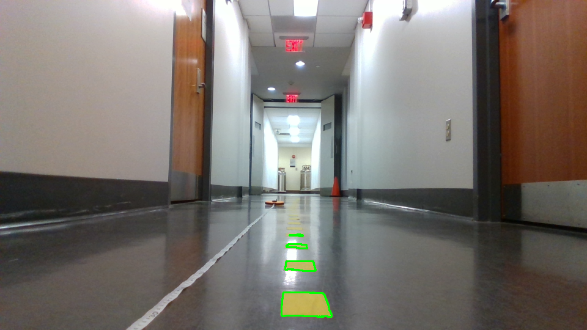
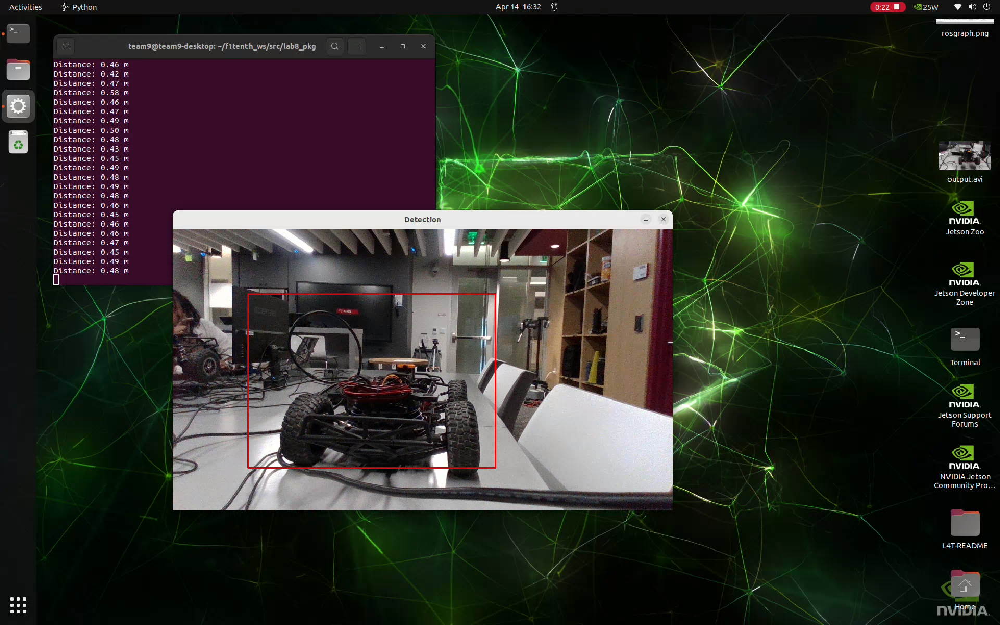
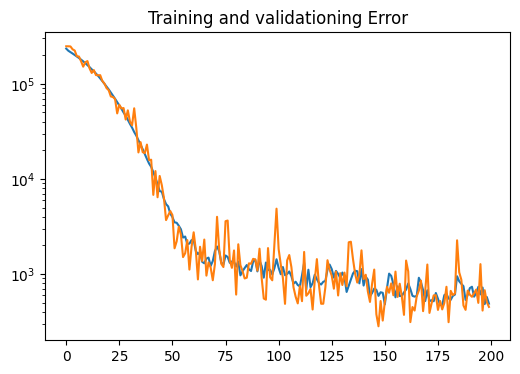

# Lab 8: Vision Lab

## The x, y distance of the unknown cones?
X_car = 0.5929 m

Y_car = 0.1282 m

## Lane Detection Result Image

## Integrated Object Detection + Distance Calculation Result Image

## Nerual Network Training & Testing Loss Plot

## Is FP16 faster? Why?
PyTorch inference time (ms): mean=3.67 ms, std=0.23 ms

FP16 inference time (ms): mean=0.66 ms, std=0.02 ms

FP32 inference time (ms): mean=1.01 ms, std=0.22 ms

GPU can pack twice as many 16-bit operations as 32-bit operations in one SIMD instruction. Jetson Orin Nano also has dedicated Tensor Cores to execute fp16 matrix multiplications.
